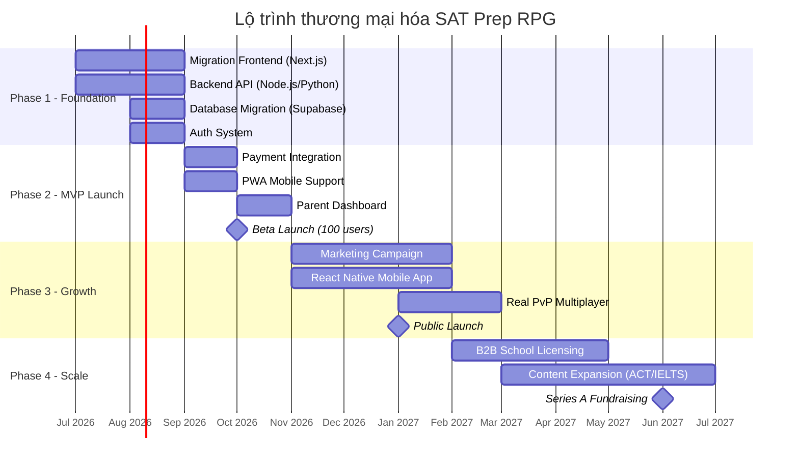

# 📊 ĐÁNH GIÁ KHẢ NĂNG THƯƠNG MẠI & LỘ TRÌNH KINH DOANH
## Ivy League Math Academy — SAT Prep RPG App

---

## 1. TỔNG QUAN DỰ ÁN HIỆN TẠI

### Kiến trúc & Công nghệ
| Thành phần | Chi tiết |
|---|---|
| **Framework** | Streamlit (Python) |
| **AI Engine** | OpenAI GPT-4o-mini |
| **Database** | SQLite + JSON files (local) |
| **Distribution** | Portable Windows bundle (152MB zip) |
| **Deployment** | Offline-first, chạy local |

### Bộ tính năng đã xây dựng (16 module)

| Nhóm | Module | Trạng thái |
|---|---|---|
| **Học tập cốt lõi** | ✨ Ôn Luyện Hằng Ngày | ✅ Hoàn thiện |
| | 📐 Chinh Phục Toán Học (16 dạng chuẩn SAT) | ✅ Hoàn thiện |
| | 📚 Làm Chủ Từ Vựng (Leitner system) | ✅ Hoàn thiện |
| | 🧮 Bí Kíp Hack Desmos | ✅ Hoàn thiện |
| | 📜 Giải Mã Văn Học Cổ | ✅ Hoàn thiện |
| **Thi & Kiểm tra** | 🏆 Đấu Trường Thi Thử | ✅ Hoàn thiện |
| | 🎓 Vượt Vũ Môn Thi Thật | ✅ Hoàn thiện |
| | 📚 Thư Viện Đề Thực Chiến | ✅ Hoàn thiện |
| **Gamification RPG** | 🗺️ Bản Đồ Sưu Tập | ✅ Hoàn thiện |
| | 🛒 Cửa Hàng Vật Phẩm (20+ items) | ✅ Hoàn thiện |
| | 📜 Sổ Tay Nhiệm Vụ (Daily/Weekly/Monthly) | ✅ Hoàn thiện |
| | 🗼 Tháp Vô Tận | ✅ Hoàn thiện |
| | 🏟️ Đấu Trường PvP (giả lập) | ✅ Hoàn thiện |
| | ⚒️ Lò Rèn Chiến Binh | ✅ Hoàn thiện |
| | 🗺️ Hành Trình Chinh Phục | ✅ Hoàn thiện |
| | 📔 Thư Viện Quái Thú | ✅ Hoàn thiện |
| **Tracking** | 📊 Nhật Ký Trưởng Thành | ✅ Hoàn thiện |

### Hệ thống Gamification sâu
- **RPG System**: Level (1-200), XP, MP, SAT Coins, Equipment (6 slot), Pets (8 loại)
- **Boss System**: 5 tiers × 4 modules = 20 boss battles
- **Quest System**: 15 daily + 15 weekly + 15 monthly quests
- **Upgrade System**: Cường hóa trang bị với tỷ lệ thành công/thất bại/vỡ đồ
- **Anti-cheat**: HMAC-SHA256 signature verification trên dữ liệu người chơi
- **Streak System**: Chuỗi học liên tục với khiên bảo vệ
- **Reward-to-Real**: Đổi xu ảo lấy phần thưởng thật (trà sữa, vé phim)

---

## 2. ĐÁNH GIÁ KHẢ NĂNG THƯƠNG MẠI

### 🟢 ĐIỂM MẠNH (Strengths)

| # | Điểm mạnh | Tác động |
|---|---|---|
| 1 | **Gamification RPG cực sâu** — Unique Selling Point mà KHÔNG đối thủ nào trên thị trường Việt Nam có được (RPG + SAT Prep). Đây là chuẩn "game hóa giáo dục" đẳng cấp quốc tế | ⭐⭐⭐⭐⭐ |
| 2 | **AI-powered content generation** — Mỗi câu hỏi đều được GPT-4o sinh động, cá nhân hóa theo điểm yếu học sinh. Không phải dạng ngân hàng câu hỏi tĩnh | ⭐⭐⭐⭐⭐ |
| 3 | **Localized 100% cho học sinh Việt** — Giao diện Tiếng Việt, nội dung giải thích bằng Tiếng Việt, trong khi đề bài SAT giữ nguyên Tiếng Anh. Rất ít sản phẩm trên thị trường làm được điều này | ⭐⭐⭐⭐⭐ |
| 4 | **Ma trận 16 dạng Toán SAT chuyên sâu** — Coverage toàn diện, đúng chuẩn College Board. Có hệ thống phân tích điểm yếu để AI tùy biến bài giảng | ⭐⭐⭐⭐ |
| 5 | **Offline-first architecture** — Portable Windows package cho phép phân phối không cần internet (quan trọng ở vùng sâu vùng xa) | ⭐⭐⭐ |
| 6 | **Reward-to-Real bridge** — Xu ảo đổi quà thật (trà sữa, vé phim) tạo động lực thực sự. Đây là killer feature về mặt tâm lý học hành vi | ⭐⭐⭐⭐⭐ |
| 7 | **Interactive AI Chat** — Hỏi-đáp sâu với gia sư AI sau mỗi câu hỏi — mô phỏng trải nghiệm gia sư 1-1 | ⭐⭐⭐⭐ |

### 🟡 ĐIỂM YẾU CẦN KHẮC PHỤC (Weaknesses)

| # | Điểm yếu | Mức nghiêm trọng | Giải pháp |
|---|---|---|---|
| 1 | **Tech Stack giới hạn** — Streamlit không phải framework sản xuất. Không scale được, không có authentication, không mobile-friendly | 🔴 Nghiêm trọng | Migrate sang Next.js/React + Backend API |
| 2 | **Single-user local** — Dữ liệu lưu JSON/SQLite local, không có cloud sync, không multi-device | 🔴 Nghiêm trọng | Xây backend với Supabase/Firebase |
| 3 | **Không có hệ thống thanh toán** — Chưa có subscription, payment gateway | 🔴 Nghiêm trọng | Tích hợp Stripe/VNPay/MoMo |
| 4 | **Chỉ chạy trên Windows** — Không có mobile app (iOS/Android), không có web version public | 🟠 Cao | Deploy web + PWA, hoặc React Native |
| 5 | **API Key exposed trong .env** — OpenAI key hardcode local, mỗi user cần tự cung cấp key | 🟠 Cao | Backend proxy API |
| 6 | **PvP giả lập** — Đấu trường PvP là bot, không phải real-time multiplayer | 🟡 Trung bình | Giai đoạn sau xây real PvP |
| 7 | **Không có analytics/dashboard cho phụ huynh** — Thiếu reporting cho người chi tiền (cha mẹ) | 🟡 Trung bình | Thêm Parent Dashboard |
| 8 | **Code duplication** — `clean_ai_text()` và `check_answer_correct()` copy-paste ở nhiều file | 🟡 Trung bình | Refactor thành shared utils |

### 🔵 CƠ HỘI THỊ TRƯỜNG (Opportunities)

| Cơ hội | Chi tiết |
|---|---|
| **Thị trường EdTech Việt Nam đang bùng nổ** | USD 3.9B (2025) → USD 4.6B (2026), CAGR 12-18% |
| **Digital SAT là xu thế bắt buộc** | College Board chuyển hoàn toàn sang Digital SAT, tạo nhu cầu app luyện thi mới |
| **Khoảng trống thị trường lớn** | Chưa có app SAT Prep **Tiếng Việt** nào có gamification RPG sâu. Khan Academy miễn phí nhưng chỉ Tiếng Anh, không gamify |
| **Chi tiêu giáo dục của hộ gia đình Việt Nam rất cao** | Giáo dục là 1 trong 3 khoản chi lớn nhất, cha mẹ sẵn sàng chi cho công cụ hiệu quả |
| **Trend AI tutor** | AI-powered personalization là xu thế hot nhất trong EdTech 2025-2026 |

### 🔴 RỦI RO (Threats)

| Rủi ro | Mức độ | Biện pháp |
|---|---|---|
| Khan Academy miễn phí & là đối tác chính thức College Board | 🟠 | Differentiate bằng gamification RPG + Tiếng Việt |
| Chi phí OpenAI API sẽ rất lớn khi scale | 🟠 | Caching thông minh, sử dụng model nhẹ hơn, batch processing |
| Streamlit không thể scale quá 100 concurrent users | 🔴 | Migration bắt buộc trước khi launch |
| Cạnh tranh từ các trung tâm luyện thi truyền thống đã có brand | 🟡 | Hybrid model: app + trung tâm |

---

## 3. KẾT LUẬN ĐÁNH GIÁ

> [!IMPORTANT]
> ### VERDICT: 🟢 KHẢ NĂNG THƯƠNG MẠI **RẤT CAO**
> 
> Dự án có **USP cực mạnh** (RPG Gamification + AI Tutor + Localized cho Việt Nam) mà **không có đối thủ trực tiếp** nào trên thị trường. Sản phẩm đã hoàn thiện ~80% về mặt tính năng cốt lõi. Tuy nhiên, cần **migration kỹ thuật lớn** để chuyển từ prototype (Streamlit) sang production-grade platform trước khi có thể thương mại hóa.

### Scoring tổng hợp

| Tiêu chí | Điểm (1-10) |
|---|---|
| Unique Value Proposition | **9/10** |
| Feature Completeness | **8/10** |
| Market Timing | **9/10** |
| Localization | **9/10** |
| Technical Readiness for Production | **3/10** |
| Monetization Readiness | **2/10** |
| Mobile Readiness | **1/10** |
| **Tổng bình quân gia quyền** | **~6.5/10** (sẵn sàng thương mại sau migration) |

---

## 4. LỘ TRÌNH THƯƠNG MẠI HÓA (GO-TO-MARKET ROADMAP)

### 🗺️ TỔNG QUAN 4 GIAI ĐOẠN



---

### 🔷 PHASE 1: FOUNDATION (Tháng 7-8/2026) — 8 tuần

> **Mục tiêu**: Chuyển đổi từ Streamlit prototype sang production-grade web platform

#### 1.1 Migration Frontend → Next.js + React
- Chuyển 16 pages Streamlit → React components
- Giữ nguyên 100% UX/UI gamification RPG
- Responsive design (mobile-first)
- SSR cho SEO

#### 1.2 Backend API
- **Option A** (Khuyến nghị): Node.js/Express + Supabase (PostgreSQL)
- **Option B**: Python FastAPI + Supabase
- RESTful API cho: Authentication, User progress, AI question generation, Payment
- API proxy cho OpenAI (ẩn API key khỏi client)

#### 1.3 Database Migration
- SQLite/JSON → PostgreSQL (Supabase)
- Schema design cho multi-user, multi-device sync
- Data migration script cho existing users

#### 1.4 Authentication
- Supabase Auth (Email/Password + Google + Facebook)
- Role-based: Student, Parent, Teacher, Admin

#### Chi phí ước tính Phase 1
| Hạng mục | Chi phí/tháng |
|---|---|
| Supabase Pro | $25/tháng |
| Vercel Pro (hosting) | $20/tháng |
| OpenAI API (development) | ~$50/tháng |
| **Tổng** | **~$95/tháng** |

---

### 🔶 PHASE 1.5: KHÓA NỀN & TỐI ƯU APP (chèn 2026-06-28) — TRƯỚC khi deploy

> [!IMPORTANT]
> **Chặng mới chèn giữa Phase 1 và Phase 2.** Lý do: đối chiếu code thật cho thấy dự án đang KẸT — code Phase 2 (engine học tập: mastery/skill-tree/score/adaptive/stats) đã viết xong ở `lib/`+`/api/*`+test NHƯNG (1) chưa nối UI (built-not-wired), và (2) nền Phase 1 chưa vững: **dữ liệu user vẫn ghi file cục bộ** → mất sạch trên serverless. Nhảy thẳng sang MVP = xây trên cát.

**Mục tiêu:** App chạy ổn trên hosting thật, dữ liệu không mất, tinh chỉnh chuẩn chỉnh. Chi tiết task → `master_task_list.md` (Phase 1.5, 7 nhóm).

**7 nhóm công việc:**
1. **Khóa nền (blockers):** persistence file→Supabase (7 bảng đã tồn tại sẵn), secrets/rotate key, RLS.
2. **Hiệu năng:** Question Bank hit-rate, prefetch câu kế, tối ưu save.
3. **UX/UI:** bỏ `alert()` → toast, chuẩn hóa loading/error/empty-state 16 trang.
4. **Chất lượng code & anti-cheat:** khép lỗ hổng 9.1, gỡ Level phẳng, dọn log, sửa schema doc.
5. **Chi phí AI & bảo mật:** kill-switch ngân sách, quota chat, cache chat, CI.
6. **Kích hoạt engine + Cổng Khảo Thí:** T1-T5 nối mastery→skill-tree→score→adaptive→checkpoint gate.
7. **Cải tiến chất lượng học:** mistake→biến thể, gợi ý theo bậc, "tại sao đáp án kia sai".

**🔑 Quyết định chốt 2026-06-28 — "CỔNG KHẢO THÍ" (Phương án A):** Đề thi vượt cấp KHÔNG hồi sinh Level phẳng. Thay vào đó là **Cổng Khảo Thí** chặn việc mở khóa chương/bậc trong Skill Tree: đạt ngưỡng mastery chương → mở Đề Thi Cổng (= Boss=Assessment); **trượt → không mở chương kế**, đẩy về luyện skill yếu (adaptive). Tuân thủ quyết định 2026-06-26 (bỏ Level phẳng). Cái bị chặn là năng lực SAT thật, không phải con số XP.

**Cột mốc:** Deploy được lên Vercel, dữ liệu bền, app chuẩn chỉnh → sẵn sàng vào Phase 2 MVP.

---

### 🔷 PHASE 2: MVP LAUNCH (Tháng 9-10/2026) — 8 tuần

> **Mục tiêu**: Ra mắt phiên bản thanh toán được, 100 beta users

#### 2.1 Mô hình kinh doanh đề xuất

```
┌─────────────────────────────────────────────────────┐
│              MÔ HÌNH FREEMIUM 3 TẦNG                │
├─────────────────────────────────────────────────────┤
│                                                     │
│  🆓 FREE (Chiến Binh Tân Sinh)                      │
│  • 5 câu hỏi AI/ngày                               │
│  • 1 bài thi thử/tuần                              │
│  • Gamification cơ bản (Level, XP, Streak)          │
│  • Quảng cáo banner                                │
│                                                     │
│  💎 PREMIUM (Kiếm Khách SAT) — 149K VNĐ/tháng     │
│  • Unlimited câu hỏi AI                            │
│  • Thi thử không giới hạn                          │
│  • Full gamification RPG (Shop, Boss, PvP, Quest)   │
│  • AI Chat hỏi-đáp không giới hạn                  │
│  • Parent Dashboard                                │
│  • Không quảng cáo                                  │
│                                                     │
│  👑 ULTIMATE (Thần Thoại) — 299K VNĐ/tháng         │
│  • Tất cả Premium                                  │
│  • 1-on-1 AI Tutor session hàng tuần               │
│  • Đề thi thật sát nhất từ AI                      │
│  • Priority support                                │
│  • Exclusive items & pets trong game                │
│  • Monthly progress report cho phụ huynh            │
│                                                     │
│  🏫 SCHOOL LICENSE — Liên hệ                       │
│  • Bulk pricing cho 50+ học sinh                    │
│  • Teacher admin dashboard                         │
│  • Custom branding                                 │
│  • Analytics cho nhà trường                        │
│                                                     │
└─────────────────────────────────────────────────────┘
```

> [!TIP]
> **Giá 149K/tháng (≈$6)** rất cạnh tranh so với Magoosh ($129/năm ≈ $10.75/tháng) và rẻ hơn 50-80x so với gia sư 1-1 truyền thống (300-500K/buổi × 8 buổi = 2.4-4 triệu/tháng).

#### 2.2 Payment Integration
- **VNPay** (chuyển khoản ngân hàng nội địa — phổ biến nhất VN)
- **MoMo** (ví điện tử — giới trẻ)
- **Stripe** (thẻ quốc tế — Việt Kiều, expat)

#### 2.3 Parent Dashboard
- Xem thống kê học tập của con (câu đúng/sai, thời gian học, streak)
- Nhận báo cáo hàng tuần qua email/Zalo
- Quản lý subscription

#### 2.4 Beta Launch
- Tuyển 100 beta users miễn phí 1 tháng
- Thu thập feedback
- Điều chỉnh pricing và UX

#### Dự kiến doanh thu Phase 2
| Kịch bản | Users | Conversion | MRR |
|---|---|---|---|
| Bi quan | 100 | 10% | 1.49M VNĐ |
| Trung bình | 100 | 25% | 3.73M VNĐ |
| Lạc quan | 100 | 40% | 5.96M VNĐ |

---

### 🔷 PHASE 3: GROWTH (Tháng 11/2026 - 1/2027) — 12 tuần

> **Mục tiêu**: 1,000-5,000 users, product-market fit

#### 3.1 Marketing Strategy

| Kênh | Hành động | Budget/tháng |
|---|---|---|
| **TikTok/Reels** | Video "SAT hack" + gameplay RPG demo | 5-10M VNĐ |
| **Facebook Groups** | Target groups "Du học", "SAT Vietnam", "Gia sư SAT" | 3-5M VNĐ |
| **KOL/Influencer** | Hợp tác với giáo viên SAT nổi tiếng trên YouTube | 5-15M VNĐ |
| **School Partnerships** | Demo miễn phí cho 10-20 trường THPT chuyên | 0 (organic) |
| **Referral Program** | Mời bạn → cả 2 được 1 tuần Premium miễn phí | 0 (organic) |
| **SEO/Content** | Blog "Kinh nghiệm thi SAT", "Lộ trình học SAT" | 2-3M VNĐ |
| **Tổng** | | **15-33M VNĐ/tháng** |

#### 3.2 React Native Mobile App
- iOS + Android native app
- Push notifications (nhắc học, Boss xuất hiện, streak sắp mất)
- Offline mode cho câu hỏi đã cache

#### 3.3 Real PvP Multiplayer
- WebSocket real-time matchmaking
- Ranked ladder system
- Weekly tournaments

#### Dự kiến doanh thu Phase 3
| Kịch bản | Users | Conversion | MRR |
|---|---|---|---|
| Bi quan | 1,000 | 8% | 11.9M VNĐ |
| Trung bình | 3,000 | 12% | 53.6M VNĐ |
| Lạc quan | 5,000 | 15% | 111.8M VNĐ |

---

### 🔷 PHASE 4: SCALE (Tháng 2-6/2027)

> **Mục tiêu**: 10,000+ users, revenue ổn định, gọi vốn

#### 4.1 B2B School Licensing
- Bán gói trường học (50+ accounts) với giá ưu đãi
- Teacher Dashboard: theo dõi lớp học, giao bài tập, xem báo cáo
- Target: 50-100 trường THPT top tại Hà Nội, TP.HCM, Đà Nẵng

#### 4.2 Content Expansion
- **ACT Prep** (thị trường Mỹ)
- **IELTS/TOEFL Prep** (thị trường rộng hơn rất nhiều)
- **Toán Olympiad** (niche nhỏ nhưng premium cao)

#### 4.3 Fundraising
- **Target**: Seed/Pre-Series A — $200K-$500K
- **Use of funds**: Team hiring (3-5 engineers), Marketing scale, Server infrastructure
- **Pitch**: "Duolingo cho SAT, nhưng là RPG — và localized cho thị trường Đông Nam Á"

#### Dự kiến doanh thu Phase 4
| Kịch bản | Users | Conversion | ARR |
|---|---|---|---|
| Bi quan | 10,000 | 10% | 1.79 tỷ VNĐ |
| Trung bình | 30,000 | 12% | 6.43 tỷ VNĐ |
| Lạc quan | 50,000 | 15% | 13.4 tỷ VNĐ |

---

## 5. UNIT ECONOMICS DỰ KIẾN

| Chỉ số | Giá trị mục tiêu |
|---|---|
| **CAC** (Chi phí thu hút 1 user) | 30-50K VNĐ |
| **LTV** (Giá trị vòng đời) | 600K-1.5M VNĐ (4-10 tháng subscription) |
| **LTV/CAC ratio** | 12-30x (✅ Healthy > 3x) |
| **Monthly churn** | 8-12% (target < 10%) |
| **Gross margin** | 75-85% (sau trừ API costs) |
| **Payback period** | 1-2 tháng |

> [!NOTE]
> Chi phí OpenAI API trung bình/user khoảng 15-25K VNĐ/tháng (với caching). Với giá subscription 149K, gross margin ~83%.

---

## 6. ĐỘI HÌNH CẦN THIẾT

| Giai đoạn | Vai trò | Số lượng |
|---|---|---|
| Phase 1-2 | Full-stack Developer (Next.js + Python) | 1-2 |
| Phase 1-2 | UI/UX Designer (part-time) | 1 |
| Phase 2 | Content Creator (SAT Tutor) | 1 |
| Phase 3 | Mobile Developer (React Native) | 1 |
| Phase 3 | Marketing Manager | 1 |
| Phase 4 | Sales (B2B School) | 1 |

---

## 7. CÁC CÂU HỎI CẦN QUYẾT ĐỊNH

> [!IMPORTANT]
> ### Câu hỏi chiến lược cần anh quyết định:
> 
> 1. **Budget khởi đầu**: Anh có sẵn sàng đầu tư ~$500-1,000/tháng cho Phase 1-2 (chi phí server + API + marketing sớm)?
> 2. **Team**: Anh có developer đồng hành không, hay cần tuyển? Hoặc anh muốn tôi xây prototype web version luôn?
> 3. **Timeline ưu tiên**: Anh muốn tập trung vào web version trước (nhanh hơn, rẻ hơn) hay mobile app trước (thị trường lớn hơn)?
> 4. **Target market ban đầu**: Bắt đầu từ học sinh tự luyện (B2C) hay trường học/trung tâm (B2B)?
> 5. **Tên thương hiệu**: "Ivy League Math Academy" có thể gặp vấn đề pháp lý (Ivy League là trademark). Cần đổi tên thương mại?
> 6. **Pricing validation**: Anh muốn test giá 149K/tháng trước hay muốn survey thị trường?

---

## 8. HÀNH ĐỘNG NGAY LẬP TỨC (Quick Wins)

Những việc có thể làm **ngay bây giờ** mà không cần migration lớn:

- [ ] **Deploy lên Streamlit Cloud** (miễn phí) để có URL public share cho demo/pitch
- [ ] **Tạo landing page** (1-page website giới thiệu) để thu thập email waitlist
- [ ] **Quay video demo** gameplay RPG → đăng TikTok/YouTube để test phản ứng thị trường
- [ ] **Đổi tên thương hiệu** tránh rủi ro pháp lý với "Ivy League"
- [ ] **Tạo Facebook Group** cộng đồng "Chiến Binh SAT Vietnam"
- [ ] **Survey 50-100 phụ huynh** về willingness to pay cho app luyện SAT

---

## 9. BỔ SUNG KỸ THUẬT TRƯỚC KHI HOÀN TẤT MIGRATION (Technical Addendum)

> [!IMPORTANT]
> Phần này được bổ sung sau khi review code thực tế của bản migration `sat-prep-web/` (Next.js).
> Các hạng mục dưới đây là quyết định kiến trúc **"rẻ nếu sửa ngay, đắt nếu sửa sau"** — nên xử lý NGAY trong lúc còn đang port dở, trước khi 16 trang + 8 API route bị khóa cứng vào thiết kế hiện tại.

### 9.1 🔴 CHẶN ĐỨNG — Anti-cheat hiện không có tác dụng trên web

**Hiện trạng:** Toàn bộ kinh tế game (coins, XP, level, PvP, forge, vòng quay) được tính ở **client** trong `GamificationContext.tsx`. Endpoint `/api/save-data` **tự ký HMAC lên bất kỳ dữ liệu nào client gửi lên** → bất kỳ ai cũng có thể `POST {coins: 999999}` và server ký nhận hợp lệ.

**Vì sao nghiêm trọng:** Plan có tính năng **Reward-to-Real** (đổi xu lấy trà sữa, vé phim, *voucher lệ phí thi SAT 100%* giá 50.000 xu). Đây là lỗ hổng gian lận quy đổi ra **tiền/giá trị thật**.

**Việc cần làm:**
- [ ] Chuyển mọi mutation kinh tế sang **server-authoritative**: client chỉ gửi *hành động* ("đã trả lời đúng câu X", "mua item Y"), server validate + tính phần thưởng + ghi DB.
- [ ] Server giữ nguồn sự thật cho: `coins`, `xp`, `level`, `maxPower`, `pvpRank`, kết quả forge, kết quả vòng quay (random phải chạy ở server).
- [ ] Logic forge/PvP (`helpers/forge.ts`, `helpers/pvp.ts`) chạy ở server hoặc được server kiểm tra lại, không tin kết quả client.
- [ ] Riêng đổi quà thật: thêm bước duyệt thủ công (admin) cho giao dịch giá trị cao.
- **Phase:** 1 (làm cùng lúc với Backend API + DB migration).

### 9.2 🟠 `/api/chat` đang là proxy mù → rủi ro chi phí + prompt injection

**Hiện trạng:** `chat/route.ts` forward nguyên `body` client sang OpenAI. Client tự chọn được `model`, `max_tokens`, và toàn bộ messages.

**Việc cần làm:**
- [ ] Whitelist model (chỉ cho `gpt-4o-mini`), ép `max_tokens` trần ở server.
- [ ] Dựng system prompt ở server, không nhận prompt thô từ client.
- [ ] **Quota theo gói freemium** (Free = 5 câu AI/ngày) — enforce ở server, đếm theo `user_id` + ngày. Hiện chưa có chỗ nào enforce giới hạn này.
- **Phase:** 1-2.

### 9.3 🟠 Đưa Auth + scope `user_id` vào NGAY (kể cả bản stub)

**Hiện trạng:** Chưa có auth. `streak_data.json` dùng chung 1 file, không phân theo người dùng.

**Vì sao làm sớm:** Nhét `user_id` vào 8 API route + context *sau khi* đã port xong sẽ phải sửa lại toàn bộ. Rẻ hơn nhiều nếu mọi route sinh ra đã có khái niệm "user hiện tại".

**Việc cần làm:**
- [ ] Tích hợp Supabase Auth sớm; mọi API route đọc `user_id` từ session.
- [ ] Mọi truy vấn dữ liệu scope theo `user_id` ngay từ đầu (kể cả khi DB còn là JSON tạm).
- **Phase:** 1.

### 9.4 🟡 Ngân hàng câu hỏi tái sử dụng (Question Bank)

**Hiện trạng:** Mỗi câu đều gọi AI sinh live → tốn token, chất lượng không kiểm soát, không tái dùng.

**Việc cần làm:**
- [ ] Lưu câu AI đã sinh vào bảng `questions`, tái sử dụng cho học sinh khác (kèm review chất lượng).
- [ ] Chiến lược lai: ưu tiên lấy từ bank, chỉ gọi AI khi cần câu mới / cá nhân hóa.
- **Tác động:** Cắt thẳng rủi ro chi phí OpenAI mà plan đã xếp 🟠. **Phase:** 2.

### 9.5 🟡 Đo lường chi phí AI + Kill-switch ngân sách

**Hiện trạng:** Plan giả định "15-25K VNĐ/user/tháng" nhưng không có cơ chế đo hay trần.

**Việc cần làm:**
- [ ] Log token in/out + ước tính cost theo từng `user_id` và toàn hệ thống.
- [ ] Ngắt mềm (degrade sang câu trong bank) khi user/hệ thống vượt ngân sách ngày.
- **Phase:** 2.

### 9.6 🟡 Pháp lý: dữ liệu trẻ vị thành niên + cơ chế random→quà thật

**Hiện trạng:** Người dùng là học sinh THPT (trẻ vị thành niên). Có vòng quay may mắn random → vật phẩm/quà giá trị thật.

**Việc cần làm:**
- [ ] Rà soát tuân thủ **Nghị định 13/2023/NĐ-CP** về bảo vệ dữ liệu cá nhân (cần đồng ý của phụ huynh cho người dưới 16 tuổi).
- [ ] Rà soát rủi ro vòng quay ngẫu nhiên → quà thật bị xem như loot box/cờ bạc; cân nhắc bỏ yếu tố random khỏi quà giá trị thật.
- **Phase:** 2 (trước Beta Launch).

### 9.7 🟡 Quyết định số phận USP "Offline-first"

**Hiện trạng:** Offline-first là 1 trong các USP gốc nhưng bản web đã đánh mất (không còn JSON cache offline).

**Việc cần làm:** Quyết định dứt điểm 1 trong 2:
- [ ] (A) Làm lại bằng Service Worker + IndexedDB (PWA) — giữ USP.
- [ ] (B) Tuyên bố bỏ USP offline, cập nhật lại marketing/positioning.
- **Phase:** 2-3 (nếu chọn A, gộp vào mục PWA của Phase 2).

### 9.8 🟡 Test & CI tối thiểu cho endpoint kinh tế/thanh toán

**Việc cần làm:**
- [ ] Integration test cho các endpoint mutation kinh tế và (sau này) payment webhook.
- [ ] CI chạy lint + test trên mỗi PR trước khi có thanh toán thật.
- **Phase:** 1-2.

### 📌 Tóm tắt ưu tiên

| # | Hạng mục | Mức độ | Phase |
|---|---|---|---|
| 9.1 | Server-authoritative anti-cheat | 🔴 Chặn đứng | 1 |
| 9.2 | Khóa proxy `/api/chat` + quota | 🟠 Cao | 1-2 |
| 9.3 | Auth + scope `user_id` sớm | 🟠 Cao | 1 |
| 9.4 | Question Bank tái sử dụng | 🟡 TB | 2 |
| 9.5 | Đo cost AI + kill-switch | 🟡 TB | 2 |
| 9.6 | Pháp lý trẻ vị thành niên + loot box | 🟡 TB | 2 |
| 9.7 | Quyết định Offline-first | 🟡 TB | 2-3 |
| 9.8 | Test & CI | 🟡 TB | 1-2 |

---

## 10. NÂNG CẤP CHẾ ĐỘ HỌC TẬP & HỆ RPG (Learning + RPG Redesign)

> [!IMPORTANT]
> ### 🎯 Nguyên tắc thiết kế cốt lõi (đọc trước tiên)
> **"KHÔNG CÓ PHẦN THƯỞNG NÀO KHÔNG ĐẾN TỪ VIỆC HỌC THẬT."**
>
> Rủi ro lớn nhất của game hóa giáo dục là RPG bị tách rời khỏi học tập → học sinh cày thưởng mà không học. Hiện tại `maxPower` (Lực chiến) tăng chủ yếu do **mua đồ** và **quay random**, gần như không liên quan năng lực SAT thật.
>
> Mọi cải tiến dưới đây tuân theo 1 luật: **mỗi cơ chế RPG phải neo vào một hành động học tập đã được server xác thực.** Luật này củng cố luôn mục 9.1 — phần thưởng server-authoritative trở thành hệ quả tự nhiên.

### 10.A — NÂNG CẤP ĐỘNG CƠ HỌC TẬP (Learning Engine)

| # | Tính năng | Mô tả & Lý do (learning science) | Phase |
|---|---|---|---|
| 10.A.1 | **Adaptive Engine (theta/IRT-lite)** | Digital SAT thật là **bài thi thích ứng (MST)** — module 2 khó/dễ tùy kết quả module 1. App phải mô phỏng: ước lượng năng lực (theta) theo từng domain, phục vụ câu đúng độ khó. Vừa **đúng trải nghiệm SAT thật**, vừa học hiệu quả hơn. | 2 |
| 10.A.2 | **Diagnostic Onboarding** | Bài test xếp lớp đầu vào → ước lượng điểm khởi đầu + xác định điểm yếu → sinh **lộ trình học cá nhân hóa**. Đây là cách hiện thực hóa USP "AI Personalization" thành cơ chế cụ thể. | 1-2 |
| 10.A.3 | **Mastery Tracking theo từng kỹ năng** ⭐ | Theo dõi % thành thạo (0-100%) cho mỗi chủ đề (16 dạng Toán + các domain Reading). **Đây là nền móng** vừa cho lộ trình học vừa cho Skill Tree RPG (10.B.1). Là dữ liệu trung tâm phải làm sớm. | 1-2 |
| 10.A.4 | **SRS Resurfacing câu sai** | Mở rộng Leitner (đang chỉ áp cho từ vựng) sang **mọi câu sai**: sổ tay sai tự động đẩy lại câu cũ theo lịch giãn cách tăng dần (như Anki). Hiện câu sai chỉ được lưu, chưa được ôn lại. | 2 |
| 10.A.5 | **Dự đoán điểm SAT (400-1600)** ⭐ | Ước lượng điểm hiện tại + đường cong tiến tới điểm mục tiêu. Đây là thứ **học sinh & phụ huynh muốn biết nhất** — động lực mạnh nhất và là tính năng dễ bán cho Parent Dashboard. | 1-2 |
| 10.A.6 | **Gợi ý theo bậc (Progressive Hints) + Lời giải từng bước** | Thang gợi ý (hint 1 → hint 2 → đáp án) thay vì lộ đáp án ngay; lời giải chi tiết theo bước. Buộc học sinh **chủ động hồi tưởng** trước khi xem đáp án. | 2 |
| 10.A.7 | **Pacing Trainer (luyện tốc độ)** | SAT bị áp lực thời gian. Theo dõi thời gian/câu, cảnh báo pacing, luyện phản xạ. | 2 |
| 10.A.8 | **Interleaving (trộn chủ đề)** | Trộn các dạng thay vì học khối — đã được chứng minh giúp ghi nhớ lâu hơn. | 2 |

### 10.B — NÂNG CẤP HỆ RPG (gắn chặt với học tập)

| # | Tính năng | Mô tả & Lý do | Phase |
|---|---|---|---|
| 10.B.1 | **Skill Tree = Bản đồ năng lực SAT** ⭐⭐ | Các node trong cây kỹ năng nhân vật **CHÍNH LÀ** mức thành thạo từng chủ đề SAT. Mở khóa node "Bậc thầy Đại số" yêu cầu đạt mastery Đại số thật. Đây là **điểm hợp nhất killer**: tiến trình RPG = độ phủ chương trình học. Phụ thuộc 10.A.3. | 2 |
| 10.B.2 | **Base Stats sinh từ hiệu suất thật** ⭐ | Trí Tuệ = mastery trung bình; Tốc Độ = pacing; Chính Xác = tỉ lệ đúng. **Trang bị chỉ là bonus cộng thêm**, không phải nguồn gốc chỉ số. Tránh "pay-to-win" trong môi trường giáo dục (đạo đức + công bằng). Phụ thuộc 10.A.3 + 9.1. | 2 |
| 10.B.3 | **Boss = Bài kiểm tra Checkpoint** ⭐ | Trận Boss yêu cầu trả lời câu hỏi: trả lời đúng → trừ máu Boss, sai → mất máu người chơi. **Combat = đánh giá năng lực**, độ khó gắn với adaptive engine. Phụ thuộc 9.4 + 10.A.1. | 2 |
| 10.B.4 | **Pet có tiện ích học tập** | Bonus của pet gắn với hành vi học tốt (pet +XP khi học buổi sáng, pet giữ streak, pet tặng thêm 1 lượt hint) thay vì chỉ +Lực chiến vô nghĩa. | 2-3 |
| 10.B.5 | **Season Pass (Mùa giải)** | Chu kỳ mùa giải hàng tháng với lộ trình phần thưởng — cơ chế **giữ chân (retention) cực mạnh** và khớp đẹp với chu kỳ subscription tháng. | 3 |
| 10.B.6 | **Study Squad / Social (trước Real PvP)** | Nhóm học bất đồng bộ, bảng xếp hạng bạn bè, mục tiêu tuần hợp tác. **Trách nhiệm xã hội (accountability)** giữ chân tốt hơn PvP bot. Làm trước Real-time PvP của Phase 3. | 3 |
| 10.B.7 | **Story Mode (Hành Trình có cốt truyện)** | Trang "Hành Trình Chinh Phục" hiện chỉ là node map. Thêm tuyến truyện: mỗi vùng = một domain kiến thức, chinh phục vùng = làm chủ domain. **Cho ý nghĩa cho việc cày.** | 3 |
| 10.B.8 | **Monetization đạo đức + Chống kiệt sức** ⭐ | Kiếm tiền **ưu tiên cosmetic** (không bán "đường tắt học tập" → tránh pay-to-learn). Nhắc nghỉ giải lao, không dùng dark pattern thao túng. Vừa **bảo vệ trẻ vị thành niên**, vừa là điểm tin cậy với phụ huynh. Gắn với 9.6. | Xuyên suốt |

### 10.C — THỨ TỰ PHỤ THUỘC & TRIỂN KHAI

```
NỀN MÓNG (Phase 1) ──────────────────────────────────────┐
  9.3 Auth + user_id                                       │
  9.1 Server-authoritative economy                         │
  10.A.3 Mastery model  ⭐ (trung tâm)                      │
  9.4 Question Bank                                         │
                                                           ▼
ĐỘNG CƠ HỌC (Phase 1-2) ──────────────────────────────────┐
  10.A.2 Diagnostic  +  10.A.5 Score Prediction            │
  10.A.1 Adaptive engine                                   │
  10.A.4 SRS  +  10.A.6 Hints  +  10.A.7 Pacing            │
                                                           ▼
HỢP NHẤT RPG (Phase 2) ───────────────────────────────────┐
  10.B.1 Skill Tree = Mastery  (cần 10.A.3)                │
  10.B.2 Stats from performance (cần 10.A.3 + 9.1)         │
  10.B.3 Boss = Assessment      (cần 9.4 + 10.A.1)         │
                                                           ▼
GIỮ CHÂN & XÃ HỘI (Phase 3)
  10.B.5 Season Pass  +  10.B.6 Study Squad  +  10.B.7 Story
  10.B.8 Đạo đức + chống kiệt sức: áp dụng XUYÊN SUỐT từ đầu
```

> [!NOTE]
> **Mastery model (10.A.3) là nút thắt then chốt** — gần như mọi tính năng học tập VÀ hợp nhất RPG đều phụ thuộc vào nó. Nên làm ngay sau Auth + Question Bank, trước khi port nốt UI gameplay.

### 🔑 QUYẾT ĐỊNH THIẾT KẾ ĐÃ CHỐT (2026-06-26)

> [!IMPORTANT]
> Ba quyết định dưới đây đã được duyệt và là **ràng buộc bắt buộc** cho mọi tính năng §10. Không làm lạc hướng.

1. ✅ **CHỐT — Stats sinh từ hiệu suất học thật.** Lực Chiến / chỉ số nhân vật được tính từ năng lực SAT thật (mastery, pacing, độ chính xác). **Trang bị & pet chỉ là bonus cộng thêm**, không phải nguồn gốc sức mạnh. Không còn "nạp/mua để mạnh". → Khóa thiết kế cho 10.B.2.

2. ✅ **CHỐT — Bỏ hẳn Level phẳng 1-200, thay bằng Skill Tree.** Không giữ song song. Hệ thống tiến trình duy nhất là **Skill Tree = bản đồ năng lực SAT** (10.B.1). Tiến trình = độ phủ + độ thành thạo chương trình học, KHÔNG phải một con số XP tích lũy vô nghĩa.
   - ⚠️ **Tác động kỹ thuật:** phải gỡ/chuyển đổi `addReward`, `getMaxXp`, logic level-up và các `BADGE_CATALOG` đang check `state.level >= X` trong `GamificationContext.tsx`. Các mốc thành tựu chuyển sang neo vào mastery/skill node thay vì số level.

3. ✅ **CHỐT — Vòng quay random chỉ trao đồ ảo.** Bỏ hoàn toàn quà giá trị thật khỏi cơ chế ngẫu nhiên (tránh rủi ro loot box/cờ bạc với trẻ vị thành niên). Quà thật (nếu có) chỉ đổi theo cách **xác định** — tích đủ xu để đổi, không qua may rủi. → Ràng buộc cho 9.6, 10.B.8 và logic `spinDailyWheel`.

